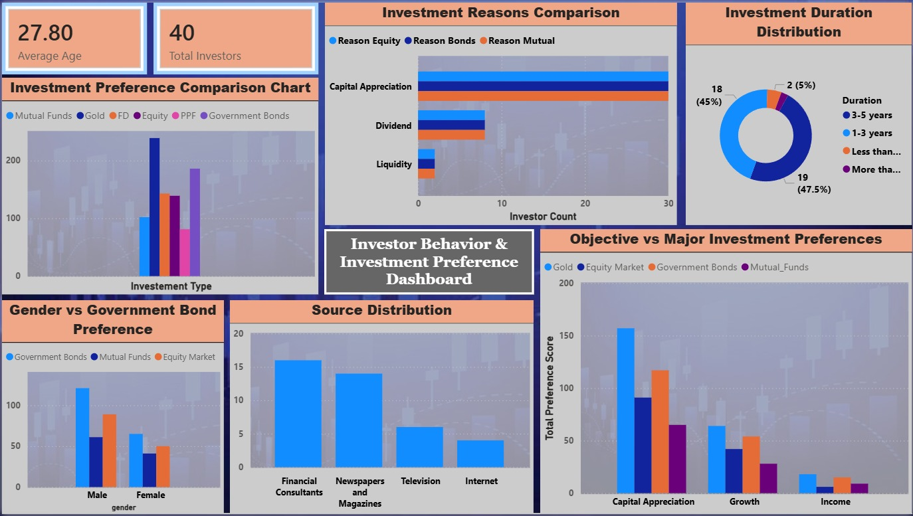

# Investor Behavior & Investment Preference Dashboard

## Overview

This project presents an interactive Power BI dashboard designed to analyze investor behavior, investment preferences, and financial decision-making patterns. The dashboard transforms raw investor survey data into actionable insights through data visualization and business intelligence techniques.

---

## Objective

The objective of this project is to explore and visualize:

* Investor demographics and age distribution
* Investment preferences across different financial avenues
* Gender-based investment behavior
* Relationship between savings objectives and investment choices
* Investment duration and monitoring patterns
* Reasons behind investment decisions
* Sources of financial information used by investors

---

## Problem Statement
Understanding investor behavior is crucial for financial institutions and analysts to identify investment trends, risk preferences, and decision-making patterns.

## Business Use Case
This dashboard can help financial advisors and institutions understand investor segmentation and optimize investment advisory strategies.

## DAX Measures Used
- Average Age
- Total Investors
- Investment Preference Score
- Gender-Based Aggregations
- Objective-Based Comparisons


## Dashboard Features

* **Investment Preference Comparison**
  Visual comparison of investor preference scores across various investment avenues.

* **Gender-Based Investment Analysis**
  Comparative analysis of male and female investment preferences.

* **Objective Analysis**
  Relationship between savings objectives and preferred investment choices.

* **Investment Duration & Monitoring Frequency**
  Analysis of how long investors stay invested and how often they monitor investments.

* **Reasons for Investment**
  Visualization of key motivations behind investment decisions.

* **Source of Information Analysis**
  Examination of where investors gather financial/investment information.

---

## Tools & Technologies Used

* **Power BI Desktop**
* **DAX (Data Analysis Expressions)**
* **Data Modeling**
* **Power Query**
* **CSV Dataset**

---

## Key Insights

* Capital Appreciation is the dominant savings objective among investors.
* Gold and Government Bonds receive strong overall preference scores.
* Male investors demonstrate higher aggregate investment preference across major avenues.
* Most investors prefer medium-term investment durations (3–5 years).
* Financial Consultants are the most relied upon source of investment information.
* Better Returns and Wealth Creation are the leading motivations for investment.

---

## Dashboard Preview


---

## Dataset Information

* **Source:** Internship/Provided Dataset
* **Format:** CSV
* **Records:** 40 Investors
* **Fields Include:**

  * Age
  * Gender
  * Investment Preferences
  * Savings Objectives
  * Investment Duration
  * Monitoring Frequency
  * Reasons for Investment
  * Information Sources

---

## Dashboard Screenshots

### Final Dashboard


## Project Structure

```text
Investor-Behavior-PowerBI-Dashboard/
│
├── Dashboard.pbix
├── Data_set_2.csv
├── dashboard-screenshot.jpeg
└── README.md
```

---

## How to Use

1. Download the repository files.
2. Open `Dashboard.pbix` in Power BI Desktop.
3. Explore the dashboard using filters and slicers.
4. Review insights and interact with visualizations.

---

## Learning Outcomes

Through this project, I strengthened my understanding of:

* Dashboard Design Principles
* Data Storytelling
* Business Intelligence Reporting
* DAX Measure Creation
* Data Cleaning and Transformation
* Insight Extraction from Raw Data

---

## Author

**Aman Sharma** 
B.Tech CSE (AI/ML) Student
Passionate about AI, ML, Data Analytics, and Business Intelligence

---

## Connect With Me

Feel free to connect with me on LinkedIn and share your feedback on the project.

---

## License

This project is intended for educational and portfolio purposes.
